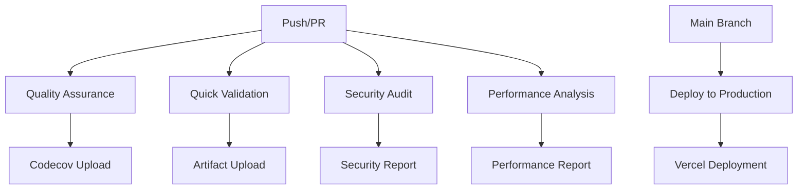

# GitHub Workflows Documentation

This directory contains the CI/CD workflows for the **Reply Speed Insights** Farcaster Mini App.

## Workflow Overview

### 🔍 Quality Assurance & Security (`ci.yml`)

**Primary workflow for all pull requests and main branch pushes**

**Purpose:** Comprehensive quality checks and basic security validation

- **Triggers:** Push to main, Pull requests
- **Jobs:**
  - `quality-checks`: Linting, testing, coverage, build verification
- **Duration:** ~3-5 minutes
- **Coverage:** Uploads to Codecov

### ⚡ Quick Validation (`ci-simple.yml`)

**Lightweight workflow for rapid feedback**

**Purpose:** Fast validation for development branches

- **Triggers:** Push to main, Pull requests
- **Jobs:**
  - `basic-tests`: Essential tests and coverage
- **Duration:** ~2-3 minutes
- **Coverage:** Uploads as artifact

### 🔒 Security Audit & Compliance (`security.yml`)

**Comprehensive security scanning**

**Purpose:** Deep security analysis and compliance checking

- **Triggers:** Push to main, Pull requests, Daily schedule, Manual
- **Jobs:**
  - `security-scan`: Dependency audit, license compliance, secrets scanning
- **Duration:** ~5-8 minutes
- **Reports:** Uploads security artifacts

### 🚀 Deploy to Production (`deploy.yml`)

**Production deployment workflow**

**Purpose:** Deploy the Mini App to production

- **Triggers:** Push to main, Tags, Manual with environment selection
- **Jobs:**
  - `deploy`: Build and deploy to Vercel
- **Duration:** ~4-6 minutes
- **Environments:** Production, Staging

### 📊 Performance & Bundle Analysis (`performance.yml`)

**Performance monitoring and optimization**

**Purpose:** Bundle analysis and performance metrics

- **Triggers:** Push to main, Pull requests, Weekly schedule, Manual
- **Jobs:**
  - `performance-audit`: Bundle analysis, performance metrics
- **Duration:** ~6-10 minutes
- **Reports:** Performance artifacts and PR comments

## Workflow Naming Convention

### Workflow Names

- **Descriptive**: Clearly indicate purpose
- **Action-oriented**: Use verbs (Deploy, Audit, Validate)
- **Context-specific**: Include the domain (Security, Performance, Quality)

### Job Names

- **kebab-case**: Use hyphens for multi-word names
- **Descriptive**: Clear purpose (quality-checks, security-scan)
- **Consistent**: Similar patterns across workflows

### Step Names

- **Action + Object**: "Run tests", "Upload coverage"
- **Emojis**: Use sparingly for visual clarity
- **Status indicators**: Include success/failure context

## Best Practices

### 1. **Separation of Concerns**

- Each workflow has a single, clear purpose
- Security checks are isolated from quality checks
- Deployment is separate from validation

### 2. **Performance Optimization**

- Use matrix strategies for multiple Node.js versions
- Cache dependencies and build artifacts
- Run expensive operations only when needed

### 3. **Error Handling**

- Use `fail_ci_if_error: false` for non-critical steps
- Provide clear error messages
- Upload artifacts even on failure

### 4. **Security**

- Use environment secrets for sensitive data
- Scan for secrets in code
- Validate license compliance

### 5. **Monitoring**

- Upload coverage reports to Codecov
- Generate performance reports
- Comment on PRs with relevant metrics

## Environment Variables

### Required Secrets

- `CODECOV_TOKEN`: For coverage reporting
- `VERCEL_TOKEN`: For deployment
- `VERCEL_ORG_ID`: Vercel organization ID
- `VERCEL_PROJECT_ID`: Vercel project ID

### Optional Secrets

- `GITHUB_TOKEN`: For PR comments (auto-provided)

## Maintenance

### Regular Updates

- Update action versions monthly
- Review and update Node.js versions
- Monitor workflow performance

### Troubleshooting

- Check workflow logs for specific failures
- Review artifact uploads for reports
- Verify secret configuration

## Workflow Dependencies

## Contributing

When adding new workflows:

1. Follow the naming convention
2. Include comprehensive documentation
3. Add appropriate triggers
4. Consider performance impact
5. Test thoroughly before merging
