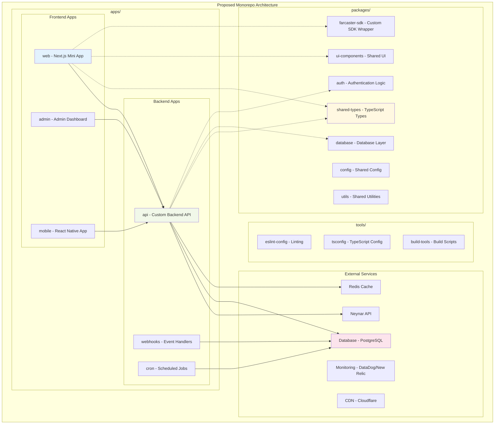
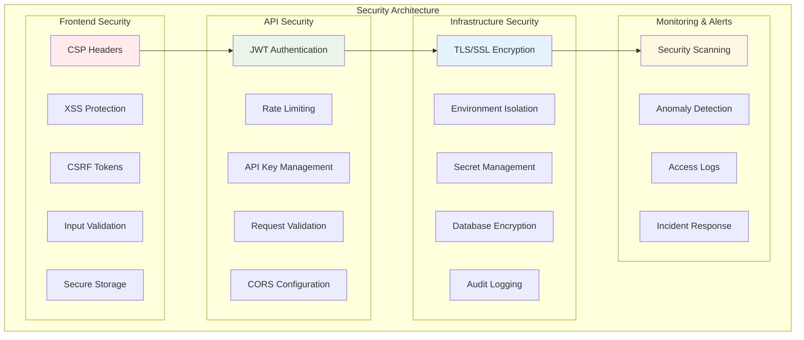
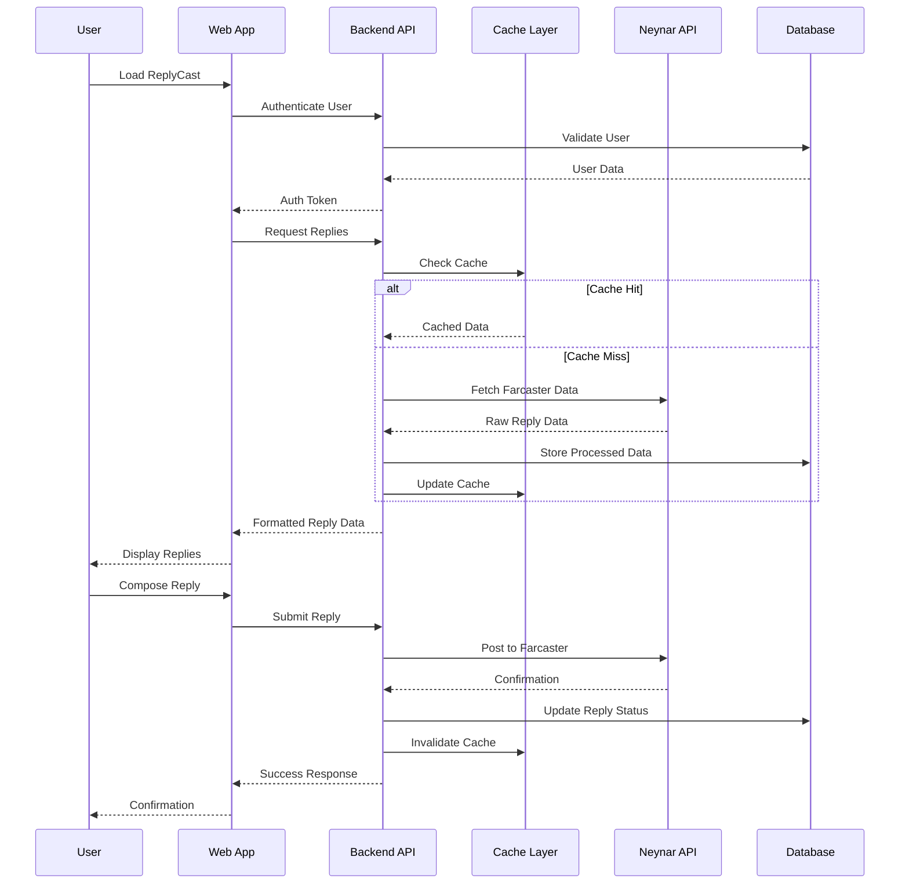
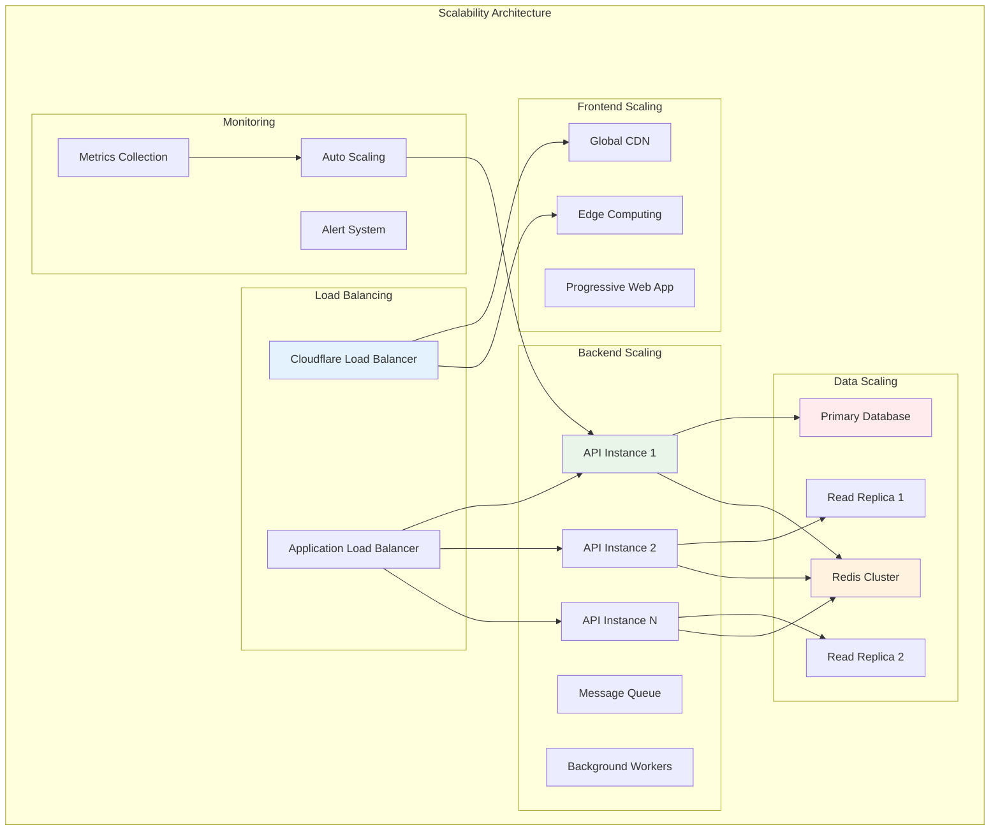
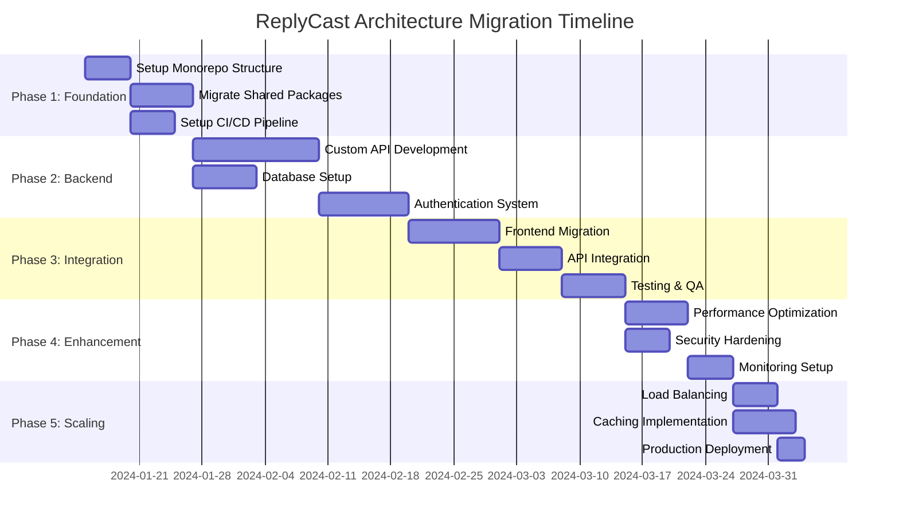

# ReplyCast Architecture Analysis & Recommendations

## Executive Summary

This document provides a comprehensive analysis of the current ReplyCast Farcaster Mini App architecture and proposes an improved, scalable architecture supporting future backend integration with a monorepo pattern. The recommendations focus on enhanced stability, scalability, and security while maintaining the excellent performance optimizations already in place.

## Current Architecture Analysis

### 🎯 Current State Overview

ReplyCast is currently a Next.js-based Farcaster Mini App with the following characteristics:

**Strengths:**
- ✅ Well-optimized Next.js application with excellent performance features
- ✅ Strong TypeScript implementation with proper type safety
- ✅ Comprehensive performance optimizations (React.memo, useMemo, dynamic imports)
- ✅ Good security headers and caching strategies
- ✅ Proper Farcaster Mini App integration with SDK
- ✅ Clean component architecture with separation of concerns

**Current Limitations:**
- ⚠️ Monolithic frontend-only architecture
- ⚠️ Direct API dependencies on external services (Neynar)
- ⚠️ Limited scalability for complex backend operations
- ⚠️ Environment configuration scattered across multiple files
- ⚠️ No centralized API management or rate limiting
- ⚠️ Limited error handling and monitoring infrastructure

### Current Architecture Diagram

```mermaid
graph TB
    subgraph "Current ReplyCast Architecture"
        subgraph "Frontend Layer"
            A[Next.js App] --> B[React Components]
            B --> C[FarcasterApp.tsx]
            B --> D[ReplyCard.tsx]
            B --> E[FarcasterSignIn.tsx]
        end
        
        subgraph "API Layer"
            F[Next.js API Routes] --> G[/api/farcaster-replies]
            F --> H[/api/og-image]
            F --> I[/api/image-proxy]
            F --> J[/api/farcaster-notification-replies]
        end
        
        subgraph "External Dependencies"
            K[Neynar API]
            L[Farcaster SDK]
            M[Vercel Analytics]
        end
        
        A --> F
        F --> K
        C --> L
        A --> M
    end
    
    style A fill:#e1f5fe
    style F fill:#f3e5f5
    style K fill:#fff3e0
```

## Proposed Monorepo Architecture

### 🚀 Recommended Architecture Overview

The proposed architecture embraces a monorepo pattern with clear separation of concerns, enhanced security, and improved scalability:



### Detailed Component Architecture

```mermaid
graph TB
    subgraph "Frontend Application (apps/web)"
        subgraph "Pages Layer"
            P1[index.tsx - Home]
            P2[api/ - API Routes]
            P3[_app.tsx - App Shell]
        end
        
        subgraph "Components Layer"
            C1[FarcasterApp - Main Container]
            C2[ReplyCard - Reply Display]
            C3[ReplyModal - Reply Interface]
            C4[AuthProvider - Authentication]
            C5[ErrorBoundary - Error Handling]
        end
        
        subgraph "Hooks Layer"
            H1[useAuth - Authentication]
            H2[useReplies - Data Fetching]
            H3[useCache - Client Cache]
            H4[useWebSocket - Real-time]
        end
        
        subgraph "Services Layer"
            S1[ApiClient - HTTP Client]
            S2[AuthService - Auth Logic]
            S3[CacheService - Caching]
            S4[ErrorService - Error Handling]
        end
    end
    
    subgraph "Backend API (apps/api)"
        subgraph "Routes Layer"
            R1[/auth - Authentication]
            R2[/replies - Reply Management]
            R3[/users - User Management]
            R4[/webhooks - Event Handlers]
        end
        
        subgraph "Services Layer"
            BS1[ReplyService - Business Logic]
            BS2[UserService - User Management]
            BS3[NotificationService - Notifications]
            BS4[CacheService - Server Cache]
        end
        
        subgraph "Data Layer"
            D1[ReplyRepository - Data Access]
            D2[UserRepository - User Data]
            D3[CacheRepository - Cache Access]
        end
    end
    
    C1 --> H1
    C1 --> H2
    H1 --> S1
    H2 --> S1
    S1 --> R1
    S1 --> R2
    R2 --> BS1
    BS1 --> D1
    
    style C1 fill:#e8f5e8
    style R2 fill:#fff3e0
    style BS1 fill:#f3e5f5
```

## Security Architecture

### 🔒 Enhanced Security Implementation



## Data Flow Architecture

### 📊 Optimized Data Flow



## Scalability Strategy

### 📈 Horizontal & Vertical Scaling



## Implementation Roadmap

### 🗓️ Phased Migration Strategy



## Monorepo Structure Recommendation

### 📁 Detailed Directory Structure

```
replycast-monorepo/
├── apps/                          # Application packages
│   ├── web/                       # Next.js Mini App (current app)
│   │   ├── pages/
│   │   ├── components/
│   │   ├── hooks/
│   │   ├── services/
│   │   └── package.json
│   ├── api/                       # Custom Backend API
│   │   ├── src/
│   │   │   ├── routes/
│   │   │   ├── services/
│   │   │   ├── repositories/
│   │   │   └── middleware/
│   │   └── package.json
│   ├── admin/                     # Admin Dashboard
│   └── mobile/                    # Future React Native App
│
├── packages/                      # Shared packages
│   ├── shared-types/              # TypeScript types
│   │   ├── src/
│   │   │   ├── api.ts
│   │   │   ├── user.ts
│   │   │   └── reply.ts
│   │   └── package.json
│   ├── ui-components/             # Shared React components
│   │   ├── src/
│   │   │   ├── Button/
│   │   │   ├── Modal/
│   │   │   └── ReplyCard/
│   │   └── package.json
│   ├── config/                    # Shared configuration
│   │   ├── src/
│   │   │   ├── env.ts
│   │   │   ├── constants.ts
│   │   │   └── validation.ts
│   │   └── package.json
│   ├── farcaster-sdk/             # Custom Farcaster SDK wrapper
│   ├── database/                  # Database schemas and migrations
│   ├── auth/                      # Authentication utilities
│   └── utils/                     # Shared utility functions
│
├── tools/                         # Development tools
│   ├── eslint-config/             # Shared ESLint configuration
│   ├── tsconfig/                  # Shared TypeScript configurations
│   └── build-tools/               # Build and deployment scripts
│
├── docs/                          # Documentation
│   ├── api/                       # API documentation
│   ├── deployment/                # Deployment guides
│   └── architecture/              # Architecture documentation
│
├── scripts/                       # Root-level scripts
│   ├── setup.sh                  # Environment setup
│   ├── migrate.sh                # Database migrations
│   └── deploy.sh                 # Deployment scripts
│
├── package.json                   # Root package.json
├── pnpm-workspace.yaml           # PNPM workspace configuration
├── turbo.json                    # Turborepo configuration
├── docker-compose.yml            # Local development environment
└── .github/                      # GitHub Actions workflows
    └── workflows/
        ├── ci.yml
        ├── deploy-web.yml
        └── deploy-api.yml
```

## Technology Stack Recommendations

### 🛠️ Enhanced Technology Stack

**Frontend Stack:**
- **Framework:** Next.js 14+ (App Router)
- **Language:** TypeScript 5+
- **Styling:** Tailwind CSS + CSS Modules
- **State Management:** Zustand + React Query
- **Testing:** Vitest + Testing Library
- **Build Tool:** Turbo + SWC

**Backend Stack:**
- **Runtime:** Node.js 20+ / Bun
- **Framework:** Fastify / Hono
- **Database:** PostgreSQL + Prisma ORM
- **Cache:** Redis
- **Queue:** BullMQ
- **Authentication:** JWT + Passport.js

**Infrastructure:**
- **Hosting:** Vercel (Frontend) + Railway/Fly.io (Backend)
- **Database:** Supabase / PlanetScale
- **CDN:** Cloudflare
- **Monitoring:** Sentry + DataDog
- **CI/CD:** GitHub Actions + Turborepo

**Development Tools:**
- **Monorepo:** Turborepo
- **Package Manager:** PNPM
- **Linting:** ESLint + Prettier
- **Type Checking:** TypeScript strict mode
- **Documentation:** Storybook + Docusaurus

## Security Enhancements

### 🔐 Comprehensive Security Strategy

**Application Security:**
```typescript
// packages/config/src/security.ts
export const securityConfig = {
  cors: {
    origin: process.env.ALLOWED_ORIGINS?.split(',') || [],
    credentials: true,
    optionsSuccessStatus: 200
  },
  rateLimiting: {
    windowMs: 15 * 60 * 1000, // 15 minutes
    max: 100, // Limit each IP to 100 requests per windowMs
    standardHeaders: true,
    legacyHeaders: false
  },
  jwt: {
    secret: process.env.JWT_SECRET,
    expiresIn: '24h',
    issuer: 'replycast-api',
    audience: 'replycast-web'
  },
  headers: {
    contentSecurityPolicy: {
      directives: {
        defaultSrc: ["'self'"],
        scriptSrc: ["'self'", "'unsafe-inline'", "https://vercel.live"],
        styleSrc: ["'self'", "'unsafe-inline'", "https://fonts.googleapis.com"],
        imgSrc: ["'self'", "data:", "https:"],
        connectSrc: ["'self'", "https://api.neynar.com"],
        fontSrc: ["'self'", "https://fonts.gstatic.com"]
      }
    }
  }
};
```

**Environment Security:**
```typescript
// packages/config/src/env.ts
import { z } from 'zod';

const envSchema = z.object({
  NODE_ENV: z.enum(['development', 'staging', 'production']),
  DATABASE_URL: z.string().url(),
  REDIS_URL: z.string().url(),
  JWT_SECRET: z.string().min(32),
  NEYNAR_API_KEY: z.string().min(20),
  ENCRYPTION_KEY: z.string().length(32),
  ALLOWED_ORIGINS: z.string(),
  SENTRY_DSN: z.string().url().optional()
});

export const env = envSchema.parse(process.env);
```

## Performance Optimizations

### ⚡ Advanced Performance Strategy

**Frontend Optimizations:**
```typescript
// apps/web/src/hooks/useOptimizedReplies.ts
import { useQuery, useInfiniteQuery } from '@tanstack/react-query';
import { useMemo } from 'react';

export function useOptimizedReplies(fid: number) {
  const {
    data,
    fetchNextPage,
    hasNextPage,
    isFetchingNextPage,
    isLoading,
    error
  } = useInfiniteQuery({
    queryKey: ['replies', fid],
    queryFn: ({ pageParam = null }) => 
      fetchReplies(fid, { cursor: pageParam }),
    getNextPageParam: (lastPage) => lastPage.nextCursor,
    staleTime: 5 * 60 * 1000, // 5 minutes
    gcTime: 10 * 60 * 1000, // 10 minutes
    refetchOnWindowFocus: false,
    retry: 3
  });

  const flattenedReplies = useMemo(() => 
    data?.pages.flatMap(page => page.replies) ?? [],
    [data]
  );

  return {
    replies: flattenedReplies,
    loadMore: fetchNextPage,
    hasMore: hasNextPage,
    isLoadingMore: isFetchingNextPage,
    isLoading,
    error
  };
}
```

**Backend Caching Strategy:**
```typescript
// apps/api/src/services/CacheService.ts
export class CacheService {
  private redis: Redis;
  
  constructor() {
    this.redis = new Redis(env.REDIS_URL);
  }
  
  async getUserReplies(fid: number, cursor?: string): Promise<Reply[]> {
    const cacheKey = `replies:${fid}:${cursor || 'initial'}`;
    
    // Try cache first
    const cached = await this.redis.get(cacheKey);
    if (cached) {
      return JSON.parse(cached);
    }
    
    // Fetch from source
    const replies = await this.fetchFromNeynar(fid, cursor);
    
    // Cache with TTL
    await this.redis.setex(cacheKey, 300, JSON.stringify(replies)); // 5 min
    
    return replies;
  }
  
  async invalidateUserCache(fid: number): Promise<void> {
    const pattern = `replies:${fid}:*`;
    const keys = await this.redis.keys(pattern);
    if (keys.length > 0) {
      await this.redis.del(...keys);
    }
  }
}
```

## Deployment & DevOps

### 🚀 Production-Ready Deployment

**CI/CD Pipeline:**
```yaml
# .github/workflows/ci.yml
name: CI/CD Pipeline

on:
  push:
    branches: [main, develop]
  pull_request:
    branches: [main]

jobs:
  test:
    runs-on: ubuntu-latest
    steps:
      - uses: actions/checkout@v4
      - uses: pnpm/action-setup@v2
        with:
          version: 8
      - uses: actions/setup-node@v4
        with:
          node-version: 20
          cache: 'pnpm'
      
      - run: pnpm install
      - run: pnpm build
      - run: pnpm test
      - run: pnpm lint
      - run: pnpm type-check

  deploy-web:
    needs: test
    if: github.ref == 'refs/heads/main'
    runs-on: ubuntu-latest
    steps:
      - uses: actions/checkout@v4
      - uses: vercel/actions@v1
        with:
          vercel-token: ${{ secrets.VERCEL_TOKEN }}
          vercel-org-id: ${{ secrets.VERCEL_ORG_ID }}
          vercel-project-id: ${{ secrets.VERCEL_PROJECT_ID }}
          working-directory: apps/web

  deploy-api:
    needs: test
    if: github.ref == 'refs/heads/main'
    runs-on: ubuntu-latest
    steps:
      - uses: actions/checkout@v4
      - uses: superfly/flyctl-actions@v1.3
        with:
          args: "deploy apps/api"
        env:
          FLY_API_TOKEN: ${{ secrets.FLY_API_TOKEN }}
```

**Docker Configuration:**
```dockerfile
# apps/api/Dockerfile
FROM node:20-alpine AS base
RUN npm install -g pnpm

FROM base AS dependencies
WORKDIR /app
COPY package.json pnpm-lock.yaml ./
COPY packages/ packages/
RUN pnpm install --frozen-lockfile

FROM base AS build
WORKDIR /app
COPY . .
COPY --from=dependencies /app/node_modules ./node_modules
RUN pnpm build

FROM base AS runtime
WORKDIR /app
RUN addgroup --system --gid 1001 nodejs
RUN adduser --system --uid 1001 nextjs
COPY --from=build --chown=nextjs:nodejs /app/apps/api/dist ./dist
COPY --from=build --chown=nextjs:nodejs /app/node_modules ./node_modules
USER nextjs
EXPOSE 3000
CMD ["node", "dist/index.js"]
```

## Benefits Analysis

### ✅ Advantages of the Proposed Architecture

**Stability Benefits:**
- **Error Isolation:** Monorepo structure isolates failures between apps
- **Type Safety:** Shared TypeScript packages ensure consistency
- **Testing:** Comprehensive testing across all packages
- **Monitoring:** Centralized logging and error tracking

**Scalability Benefits:**
- **Horizontal Scaling:** Independent scaling of frontend and backend
- **Performance:** Optimized caching and CDN distribution
- **Load Distribution:** Multiple backend instances with load balancing
- **Database Optimization:** Read replicas and connection pooling

**Security Benefits:**
- **Defense in Depth:** Multiple security layers
- **Zero Trust:** Proper authentication and authorization
- **Data Protection:** Encrypted data storage and transmission
- **Compliance:** GDPR and privacy regulation compliance

**Development Benefits:**
- **Code Reuse:** Shared packages reduce duplication
- **Consistency:** Unified tooling and configurations
- **Productivity:** Faster development with shared components
- **Maintainability:** Clear separation of concerns

## Conclusion & Recommendations

### 🎯 Strategic Recommendations

1. **Immediate Actions (Next 2 weeks):**
   - Set up the monorepo structure with Turborepo
   - Extract shared types and utilities into packages
   - Implement basic CI/CD pipeline

2. **Short-term Goals (1-2 months):**
   - Develop custom backend API with proper authentication
   - Migrate frontend to use new backend endpoints
   - Implement comprehensive caching strategy

3. **Medium-term Goals (3-6 months):**
   - Add admin dashboard for monitoring and management
   - Implement real-time features with WebSockets
   - Enhance security with advanced monitoring

4. **Long-term Vision (6+ months):**
   - Mobile app development using shared packages
   - Advanced analytics and user insights
   - Multi-tenant architecture for enterprise features

### Validation of Monorepo Approach

**✅ Monorepo is the RIGHT approach for ReplyCast because:**

1. **Shared Codebase:** Frontend and backend will share significant code (types, utilities, components)
2. **Coordinated Releases:** Features often span both frontend and backend
3. **Developer Experience:** Single repository simplifies development workflow
4. **Dependency Management:** Easier to manage shared dependencies
5. **Atomic Changes:** Changes across multiple packages can be committed together
6. **Tooling Consistency:** Shared linting, testing, and build configurations

**Recommended Tools:**
- **Turborepo:** For build orchestration and caching
- **PNPM Workspaces:** For package management
- **Shared ESLint/Prettier:** For code consistency
- **Shared TypeScript configs:** For type consistency

This architecture provides a solid foundation for scaling ReplyCast into a comprehensive Farcaster ecosystem tool while maintaining the excellent performance and user experience you've already achieved.