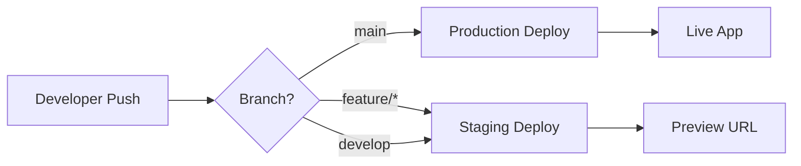

# 🚀 Deployment Guide

## Overview

This project uses **Vercel** for automated deployments with branch-based environment management.

## 🌍 Environment Strategy

### **Staging Environment**

- **Trigger**: Push to any branch except `main`
- **URL**: `https://replycast-git-{branch-name}.vercel.app`
- **Purpose**: Development and testing
- **Auto-deploy**: ✅ Enabled

### **Production Environment**

- **Trigger**: Push to `main` branch
- **URL**: `https://replycast.vercel.app` (or your custom domain)
- **Purpose**: Live production app
- **Auto-deploy**: ✅ Enabled

## 🔄 Deployment Workflow



## 🛠️ How It Works

### **Automatic Deployment**

1. **Push to any branch** → Vercel detects changes
2. **Build process** → Vercel runs `pnpm build`
3. **Deploy** → Creates preview or production deployment
4. **Notification** → Vercel sends deployment status

### **Manual Deployment**

```bash
# Deploy current branch to preview
vercel

# Deploy to production (requires main branch)
vercel --prod
```

## 🔧 Vercel Configuration

### **Build Settings**

- **Framework Preset**: Next.js
- **Build Command**: `pnpm build`
- **Output Directory**: `.next`
- **Install Command**: `pnpm install`

### **Environment Variables**

- **Production**: Set in Vercel dashboard
- **Preview**: Inherits from production + branch-specific overrides
- **Local**: Uses `.env.local`

## 📊 Deployment Status

### **Check Deployments**

- **Vercel Dashboard**: https://vercel.com/dashboard
- **GitHub Integration**: See deployment status in PRs
- **CLI**: `vercel ls` to list deployments

### **Deployment URLs**

- **Production**: `https://your-app.vercel.app`
- **Preview**: `https://your-app-git-branch.vercel.app`
- **Local**: `http://localhost:3000`

## 🚨 Troubleshooting

### **Common Issues**

1. **Build Failures**: Check Vercel build logs
2. **Environment Variables**: Verify in Vercel dashboard
3. **Domain Issues**: Check DNS settings
4. **Performance**: Monitor Vercel analytics

### **Debug Commands**

```bash
# Check Vercel status
vercel status

# View deployment logs
vercel logs [deployment-url]

# Test locally with Vercel environment
vercel dev
```

## 🔐 Security Considerations

- **Environment Variables**: Never commit secrets to git
- **Branch Protection**: Use GitHub branch protection rules
- **Access Control**: Limit Vercel team access
- **Domain Security**: Use HTTPS and proper DNS

## 📈 Monitoring

### **Vercel Analytics**

- **Real-time**: User sessions and performance
- **Core Web Vitals**: LCP, FID, CLS metrics
- **Error Tracking**: JavaScript errors and exceptions

### **Custom Monitoring**

- **Health Check**: `/api/health` endpoint
- **Uptime**: External monitoring services
- **Performance**: Custom audit scripts

---

_This deployment strategy provides automatic, reliable deployments with proper environment separation._
