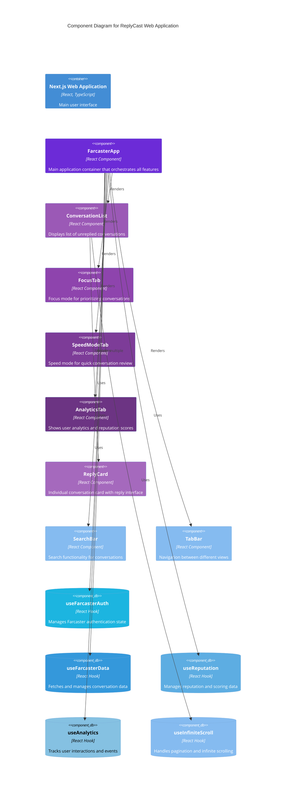

# C4 Model - Component Diagram

## Component Diagram

This diagram shows the key components within the Next.js Web Application container.

## Component Descriptions

### UI Components

**FarcasterApp**
- Main orchestrator component
- Manages global state (theme, active tab, settings)
- Coordinates between different tabs and features
- Handles authentication flow

**ConversationList**
- Displays paginated list of unreplied conversations
- Supports filtering, sorting, and search
- Handles infinite scroll for loading more conversations

**FocusTab**
- Provides focused view for prioritizing conversations
- Shows conversations that need immediate attention
- Includes tutorial for first-time users

**SpeedModeTab**
- Quick review mode for conversations
- Swipe gestures for fast navigation
- Optimized for mobile interactions

**AnalyticsTab**
- Displays user statistics and reputation scores
- Shows OpenRank, Quotient, and Following Rank
- Visual charts and metrics

**ReplyCard**
- Individual conversation display
- Reply interface with character counter
- Shows cast context and metadata

**SearchBar & TabBar**
- Navigation and search UI components

### Custom Hooks

**useFarcasterAuth**
- Manages Farcaster SDK authentication
- Handles sign-in flow and user context

**useFarcasterData**
- Fetches conversation data from API
- Manages loading states, pagination, and caching
- Handles error states and retries

**useReputation**
- Fetches and manages reputation scores
- Caches OpenRank and Quotient data
- Provides reputation-based filtering

**useAnalytics**
- Tracks user interactions via Vercel Analytics
- Logs events for app usage analysis

**useInfiniteScroll**
- Handles pagination logic
- Manages cursor-based loading
- Detects scroll position for auto-loading

