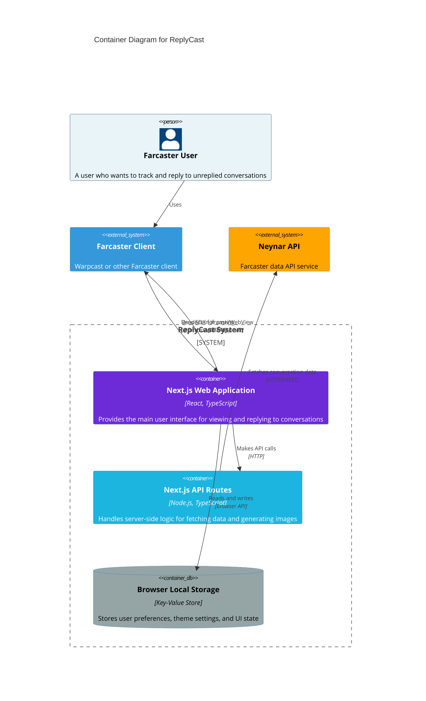

# C4 Model - Container Diagram

## Container Diagram

This diagram zooms into the ReplyCast system, showing the applications and data stores.

## Container Descriptions

### Next.js Web Application
- **Technology**: React, TypeScript, Tailwind CSS
- **Responsibilities**:
  - Renders the main UI (tabs, conversation list, reply interface)
  - Manages client-side state and user interactions
  - Handles authentication via Farcaster SDK
  - Provides search, filtering, and sorting capabilities
  - Manages themes and user preferences

### Next.js API Routes
- **Technology**: Node.js, TypeScript
- **Responsibilities**:
  - `/api/farcaster-replies` - Fetches unreplied conversations from Neynar
  - `/api/og-image` - Generates dynamic OpenGraph images using Satori
  - `/api/openRank` - Fetches OpenRank data for reputation scoring
  - `/api/quotient` - Fetches Quotient scores
  - `/api/image-proxy` - Proxies images for CORS and caching
  - Implements caching strategies for performance

### Browser Local Storage
- **Technology**: Browser Web Storage API
- **Responsibilities**:
  - Stores user preferences (theme mode, view mode, sort options)
  - Persists active tab selection
  - Caches UI state across sessions

