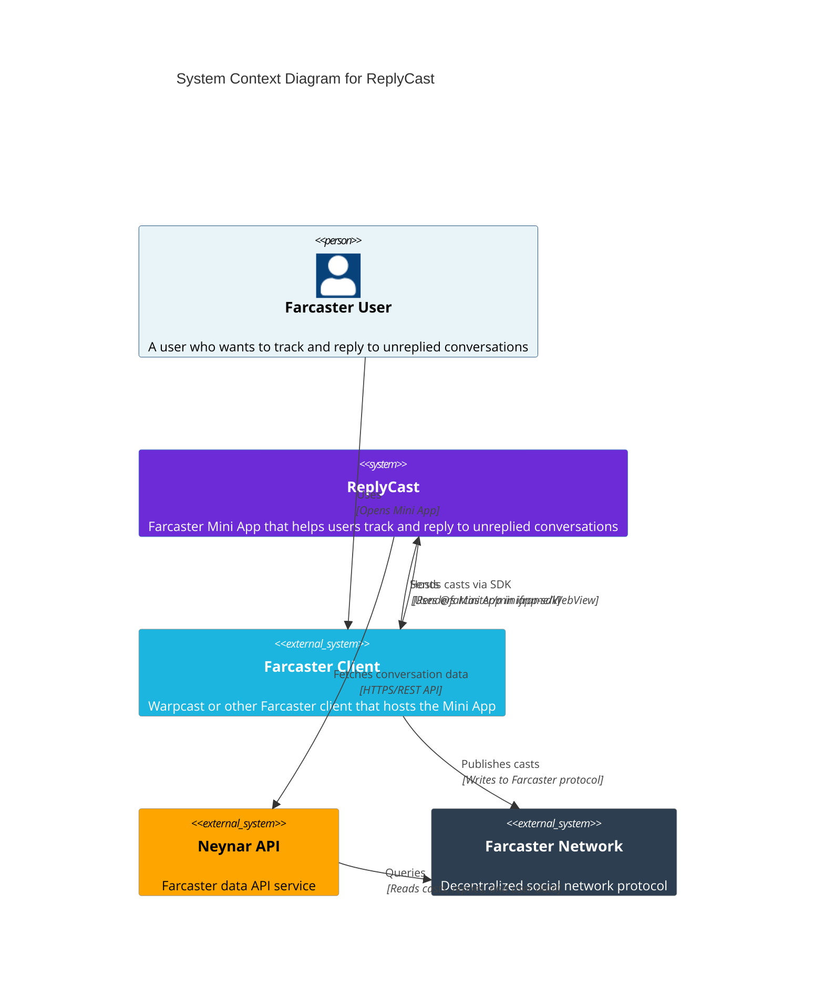

# C4 Model - System Context Diagram

## System Context

This diagram shows the ReplyCast system and how it interacts with external users and systems.

## Description

The **ReplyCast** system is a Farcaster Mini App that helps users track and reply to unreplied conversations. 

### Key Relationships

- **Farcaster Users** interact with the app through their Farcaster client (e.g., Warpcast)
- **Farcaster Client** hosts the Mini App and provides the SDK for authentication and casting
- **Neynar API** provides access to Farcaster conversation data
- **Farcaster Network** is the underlying decentralized protocol that stores all social data

