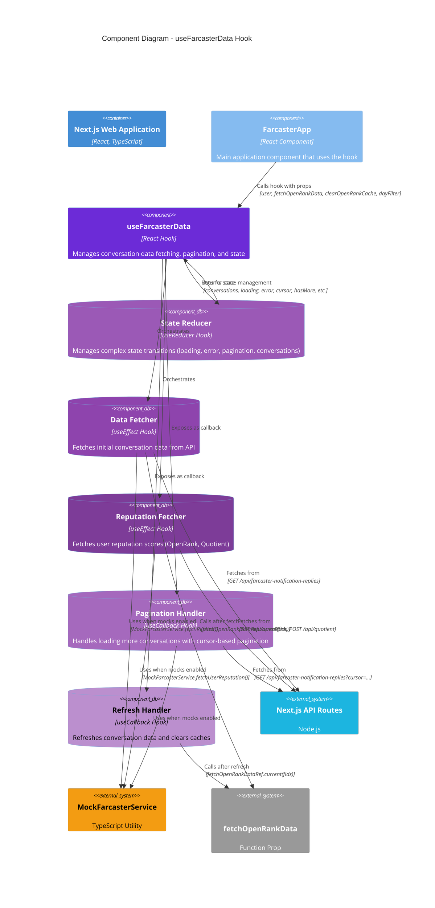

# C4 Model - useFarcasterData Component Diagram

## Component Diagram for useFarcasterData Hook

This diagram shows the detailed structure and interactions of the `useFarcasterData` hook, which is the core data management hook for fetching and managing Farcaster conversation data.

## Detailed Component Descriptions

### useFarcasterData Hook

**Purpose**: Central data management hook for Farcaster conversation data

**Responsibilities**:
- Manages conversation fetching, pagination, and state
- Coordinates reputation score fetching
- Handles loading, error, and refresh states
- Provides callbacks for pagination and refresh
- Deduplicates conversations to prevent duplicates

**State Management**:
- Uses `useReducer` for complex state transitions
- Manages: `loading`, `error`, `isRefreshing`, `conversations`, `cursor`, `hasMore`, `isLoadingMore`
- Tracks user reputation: `userOpenRank`, `userQuotientScore`, `userFollowingRank`

**Key Features**:
- Abort controller support for cleanup
- Mock service integration for testing
- Automatic OpenRank fetching for conversation authors
- Cursor-based pagination
- Deduplication logic

### Internal Components

#### State Reducer
- **Type**: `useReducer` with custom reducer function
- **Actions**: `FETCH_START`, `FETCH_SUCCESS`, `FETCH_ERROR`, `LOAD_MORE_START`, `LOAD_MORE_SUCCESS`, `REFRESH_START`, `REFRESH_SUCCESS`, `SET_USER_RANKS`, `RESET_PAGINATION`
- **Purpose**: Centralized state management with predictable transitions

#### Data Fetcher
- **Type**: `useEffect` hook
- **Triggers**: When `user.fid` or `dayFilter` changes
- **Responsibilities**:
  - Fetches initial conversation data
  - Handles abort signals for cleanup
  - Dispatches success/error actions
  - Triggers OpenRank fetching for authors

#### Reputation Fetcher
- **Type**: `useEffect` hook
- **Triggers**: When `user.fid` changes
- **Responsibilities**:
  - Fetches user's own OpenRank and Quotient scores
  - Parallel API calls for performance
  - Updates state with reputation data

#### Pagination Handler
- **Type**: `useCallback` hook
- **Purpose**: Loads more conversations using cursor-based pagination
- **Features**:
  - Prevents duplicate requests
  - Handles abort signals
  - Merges new conversations with existing ones
  - Updates cursor and `hasMore` state

#### Refresh Handler
- **Type**: `useCallback` hook
- **Purpose**: Refreshes conversation data
- **Features**:
  - Clears OpenRank cache
  - Uses `cache: "no-store"` for fresh data
  - Resets pagination state
  - Triggers new OpenRank fetches

## Data Flow

### Initial Load
1. `FarcasterApp` calls `useFarcasterData` with user and callbacks
2. `dataFetcher` effect triggers when user is available
3. Fetches from `/api/farcaster-notification-replies` or mock service
4. Dispatches `FETCH_SUCCESS` with conversation data
5. Automatically fetches OpenRank for conversation authors
6. `reputationFetcher` fetches user's own reputation scores

### Pagination
1. User scrolls to bottom or triggers load more
2. `FarcasterApp` calls `loadMoreConversations()`
3. `paginationHandler` checks if more data is available
4. Fetches next page using cursor from state
5. Merges new conversations with existing (deduplicated)
6. Updates cursor and `hasMore` state

### Refresh
1. User clicks refresh button
2. `FarcasterApp` calls `handleRefresh()`
3. `refreshHandler` clears OpenRank cache
4. Fetches fresh data with `cache: "no-store"`
5. Resets pagination state
6. Triggers new OpenRank fetches

## API Dependencies

### `/api/farcaster-notification-replies`
- **Method**: GET
- **Query Params**: `fid`, `limit`, `cursor?`, `dayFilter?`
- **Returns**: `FarcasterRepliesResponse` with `unrepliedDetails` and `nextCursor`
- **Purpose**: Fetches unreplied conversations for a user

### `/api/openRank`
- **Method**: GET
- **Query Params**: `fids` (comma-separated)
- **Returns**: OpenRank scores for specified FIDs
- **Purpose**: Fetches engagement and following ranks

### `/api/quotient`
- **Method**: POST
- **Body**: `{ fids: number[] }`
- **Returns**: Quotient scores for specified FIDs
- **Purpose**: Fetches Quotient reputation scores

## Mock Service Integration

When `NEXT_PUBLIC_USE_MOCKS=true` or `window.__FORCE_MOCKS__` is set:
- `MockFarcasterService.fetchReplies()` - Returns mock conversation data
- `MockFarcasterService.fetchUserReputation()` - Returns mock reputation scores
- Simulates API delays and error conditions
- Used for development and testing

## Error Handling

- **AbortError**: Silently ignored (component unmounted or dependency changed)
- **Network Errors**: Dispatched as `FETCH_ERROR` with error message
- **API Errors**: Caught and converted to error state
- **Validation**: Checks for user FID before making requests

## Performance Optimizations

1. **Abort Controllers**: Prevents memory leaks from cancelled requests
2. **Deduplication**: Prevents duplicate conversations in state
3. **Parallel Fetching**: Reputation scores fetched in parallel
4. **Fire-and-Forget**: OpenRank fetching doesn't block UI updates
5. **Refs for Callbacks**: Avoids dependency issues with external functions
6. **Primitive Dependencies**: Only primitive values in dependency arrays

