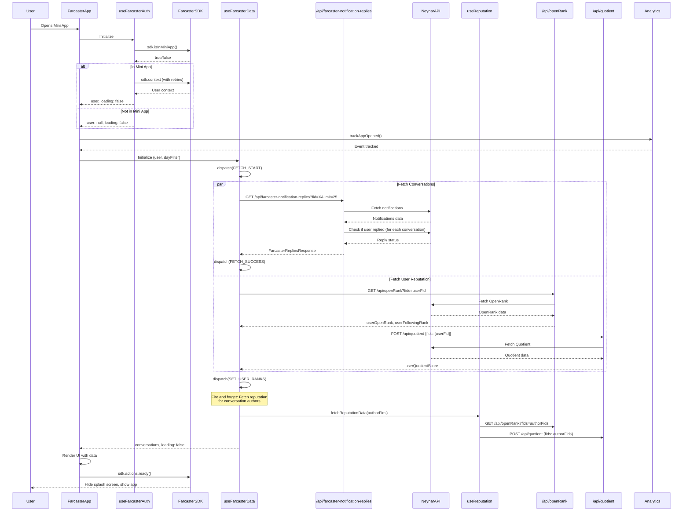

# Sequence Diagram - App Initialization Flow

This diagram shows how the app initializes when a user opens it, including authentication, data fetching, and reputation loading.

## Key Interactions

1. **Authentication**: App checks if it's in a Mini App environment and retrieves user context
2. **Parallel Data Fetching**: Conversations and user reputation are fetched in parallel
3. **Background Reputation Fetching**: After conversations load, reputation for authors is fetched asynchronously
4. **SDK Ready**: App signals it's ready to hide the splash screen
