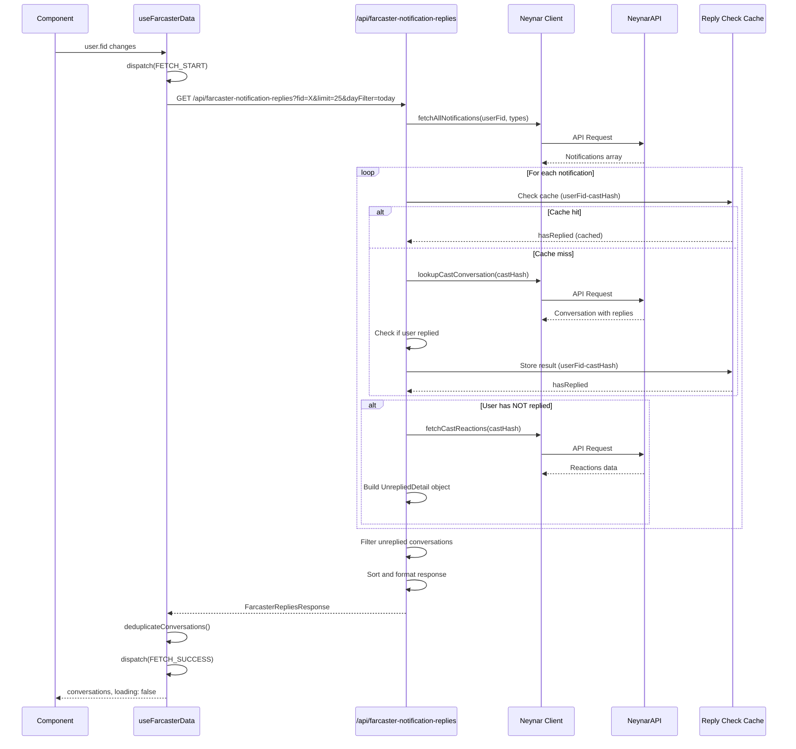

# Sequence Diagram - Conversation Fetching Flow

This diagram shows how conversations are fetched, including the API route logic and Neynar integration.

## Key Interactions

1. **Notification Fetching**: Gets all notifications from Neynar
2. **Reply Checking**: For each notification, checks if user has replied (with caching)
3. **Reaction Fetching**: Gets likes/recasts for unreplied conversations
4. **Deduplication**: Removes duplicate conversations before returning
