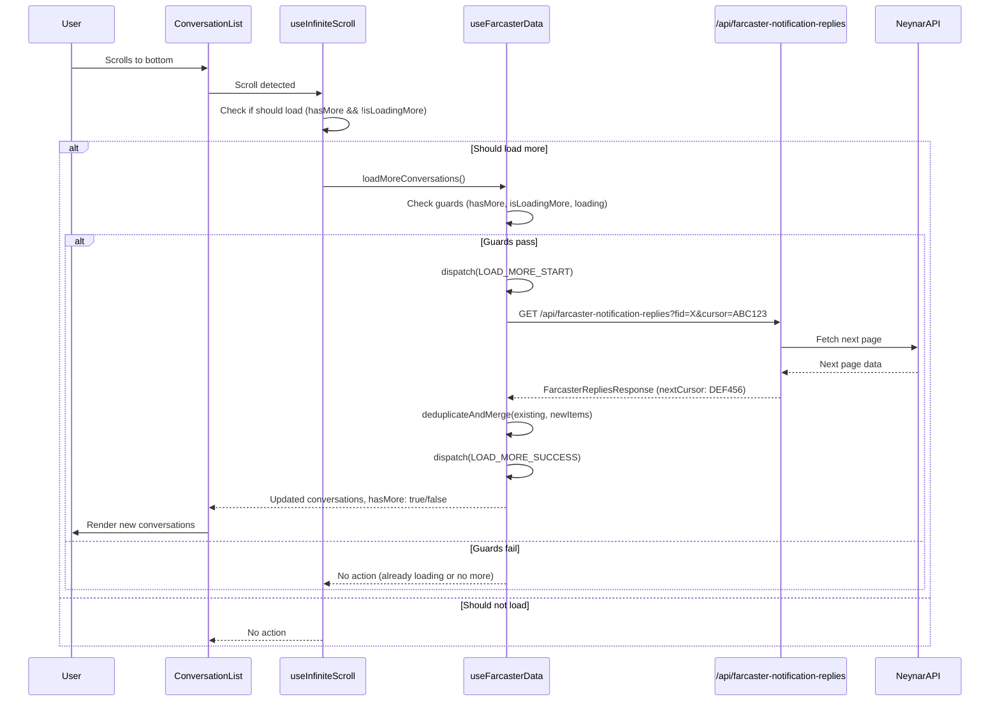

# Sequence Diagram - Pagination Flow

This diagram shows how infinite scroll pagination works when loading more conversations.

## Key Interactions

1. **Scroll Detection**: `useInfiniteScroll` detects when user reaches bottom
2. **Guard Checks**: Prevents duplicate requests and unnecessary calls
3. **Cursor-based Pagination**: Uses cursor from previous response
4. **Deduplication**: Merges new items with existing, removing duplicates
