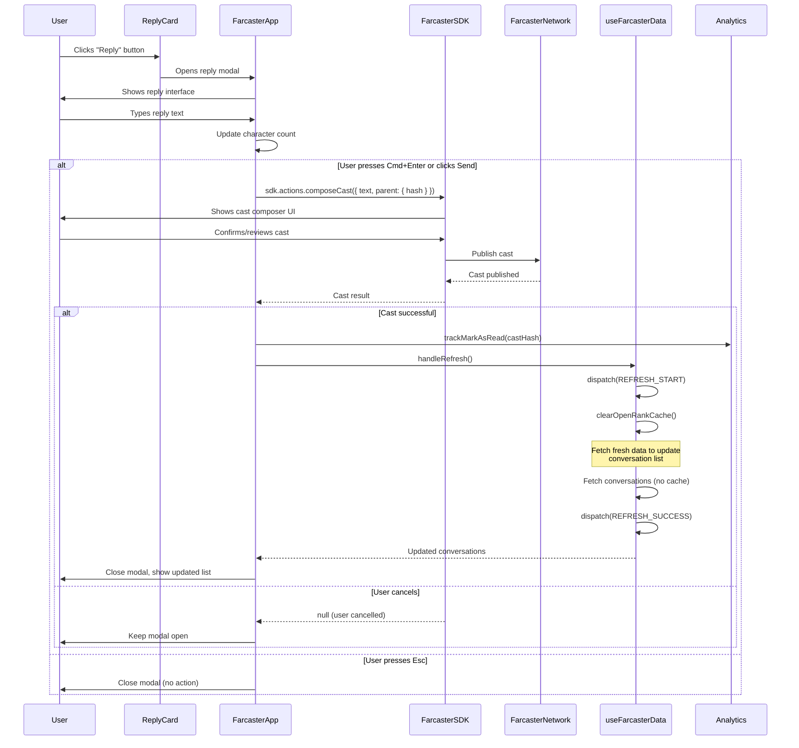

# Sequence Diagram - Reply Flow

This diagram shows how a user replies to a conversation using the Farcaster SDK.

## Key Interactions

1. **Reply Initiation**: User opens reply modal from conversation card
2. **SDK Integration**: Uses Farcaster SDK to compose and publish cast
3. **Data Refresh**: After successful reply, refreshes conversation list
4. **Analytics**: Tracks the reply action
