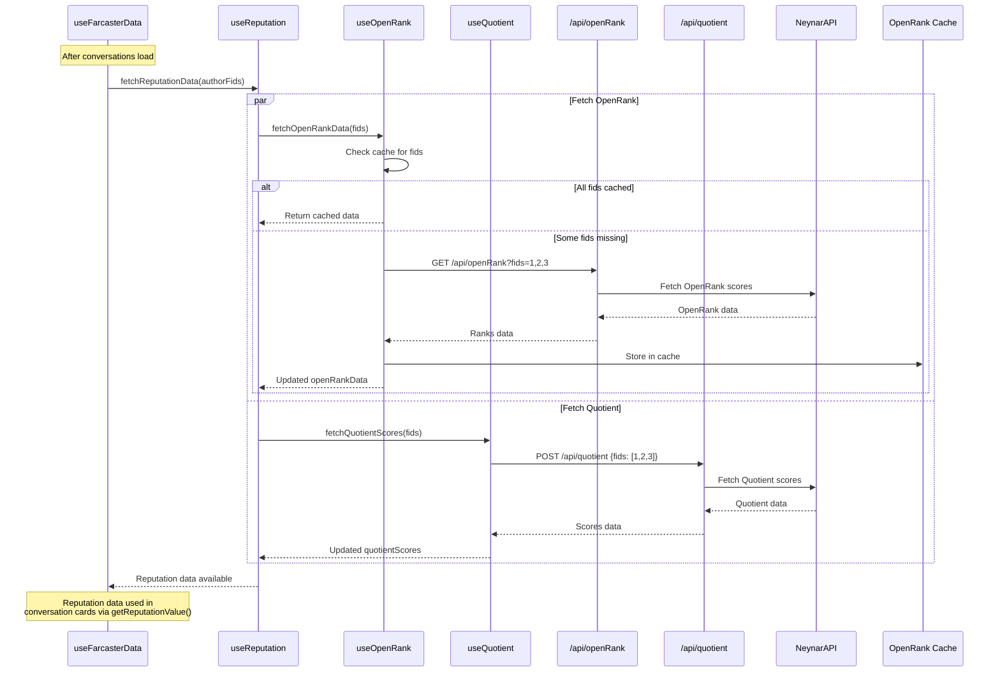

# Sequence Diagram - Reputation Data Fetching Flow

This diagram shows how reputation scores (OpenRank and Quotient) are fetched for users.

## Key Interactions

1. **Parallel Fetching**: OpenRank and Quotient are fetched simultaneously
2. **Caching**: OpenRank uses cache to avoid redundant API calls
3. **Batch Requests**: Multiple FIDs are requested in single API call
4. **Data Aggregation**: `useReputation` combines both data sources
